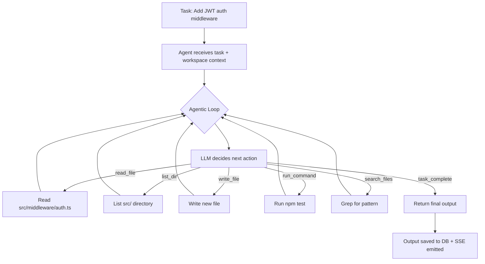

# Implementation Plan: Real Codebase Execution for AgentForge Agents

## The Gap Today

Your current architecture is a **single-shot LLM call per task**:

```
Task Description → LLM (system + user prompt) → Markdown output (text only)
```

The agent has **no awareness** of the user's actual codebase. It can't read files, write files, or run commands. It's essentially a very structured ChatGPT wrapper.

To make agents work on a real codebase, you need to transform them from **text generators** into **tool-using agents** that operate in an iterative loop.

---

## Target Architecture



Instead of one LLM call, each task becomes a **multi-step loop** where the LLM calls tools, observes results, and decides the next action — exactly like how Claude Code, Cursor Agent, or Devin work.

---

## What Needs to Change (5 Layers)

### Layer 1: Workspace & Sandbox System
### Layer 2: Tool Definitions & Execution Engine  
### Layer 3: Agentic Loop (replacing single-shot execution)
### Layer 4: Streaming Progress to the Dashboard
### Layer 5: Session Configuration (which project to work on)

---

## Phase 1: Workspace & Sandbox System

### New Config

```env
# .env additions
WORKSPACE_BASE_DIR=/home/user/projects
MAX_COMMAND_TIMEOUT_MS=30000
ALLOWED_COMMANDS=npm,npx,node,git,cat,ls,find,grep,mkdir,touch
SANDBOX_MODE=permissive  # permissive | strict (strict = Docker container)
```

### New Files

```
backend/src/
├── workspace/
│   ├── workspace.manager.ts     # Validates paths, prevents escapes
│   ├── file.service.ts          # read, write, list, search operations
│   └── command.service.ts       # Sandboxed shell command execution
```

### `workspace.manager.ts` — Key Design

```typescript
// Every session is bound to a workspace directory
// All file operations are jailed to this directory

export class WorkspaceManager {
  private readonly rootDir: string;

  constructor(workspaceDir: string) {
    // Resolve to absolute, prevent symlink escapes
    this.rootDir = fs.realpathSync(path.resolve(workspaceDir));
  }

  /** Ensures a path is within the workspace. Throws if escape detected. */
  resolveSafePath(relativePath: string): string {
    const resolved = fs.realpathSync(path.resolve(this.rootDir, relativePath));
    if (!resolved.startsWith(this.rootDir)) {
      throw new Error(`Path escape detected: ${relativePath}`);
    }
    return resolved;
  }

  /** Get workspace structure (tree) for initial LLM context */
  async getProjectTree(maxDepth = 3): Promise<string> { ... }

  /** Read .gitignore-aware file listing */
  async getRelevantFiles(): Promise<string[]> { ... }
}
```

> [!CAUTION]
> Path traversal is the #1 security risk. The `resolveSafePath` function MUST validate every single file operation. Never trust LLM-generated paths directly.

---

## Phase 2: Tool Definitions & Execution Engine

### Tool Schema

Define tools that the LLM can call. These map to real filesystem/shell operations:

```typescript
// backend/src/workspace/tools.ts

export interface ToolDefinition {
  name: string;
  description: string;
  parameters: Record<string, { type: string; description: string; required?: boolean }>;
}

export const AGENT_TOOLS: ToolDefinition[] = [
  {
    name: 'read_file',
    description: 'Read the contents of a file. Returns the file content as text.',
    parameters: {
      path: { type: 'string', description: 'Relative path from workspace root', required: true },
      start_line: { type: 'number', description: 'Optional start line (1-indexed)' },
      end_line: { type: 'number', description: 'Optional end line (1-indexed)' },
    },
  },
  {
    name: 'write_file',
    description: 'Create or overwrite a file with the given content.',
    parameters: {
      path: { type: 'string', description: 'Relative path from workspace root', required: true },
      content: { type: 'string', description: 'Full file content to write', required: true },
    },
  },
  {
    name: 'edit_file',
    description: 'Replace specific text in a file. Use for surgical edits.',
    parameters: {
      path: { type: 'string', description: 'File to edit', required: true },
      old_text: { type: 'string', description: 'Exact text to find and replace', required: true },
      new_text: { type: 'string', description: 'Replacement text', required: true },
    },
  },
  {
    name: 'list_directory',
    description: 'List files and subdirectories in a directory.',
    parameters: {
      path: { type: 'string', description: 'Directory path relative to workspace', required: true },
      recursive: { type: 'boolean', description: 'Whether to list recursively (default: false)' },
    },
  },
  {
    name: 'search_files',
    description: 'Search for a text pattern across files (like grep).',
    parameters: {
      pattern: { type: 'string', description: 'Search pattern (regex or literal)', required: true },
      path: { type: 'string', description: 'Directory to search in (default: workspace root)' },
      file_glob: { type: 'string', description: 'File glob pattern, e.g. "*.ts"' },
    },
  },
  {
    name: 'run_command',
    description: 'Execute a shell command in the workspace directory. Use for npm, git, tests.',
    parameters: {
      command: { type: 'string', description: 'Shell command to run', required: true },
    },
  },
  {
    name: 'task_complete',
    description: 'Signal that the task is done. Provide a summary of changes made.',
    parameters: {
      summary: { type: 'string', description: 'Markdown summary of what was done', required: true },
    },
  },
];
```

### Tool Executor

```typescript
// backend/src/workspace/tool-executor.ts

export class ToolExecutor {
  constructor(
    private workspace: WorkspaceManager,
    private commandService: CommandService,
    private signal?: AbortSignal
  ) {}

  async execute(toolName: string, args: Record<string, unknown>): Promise<ToolResult> {
    switch (toolName) {
      case 'read_file':
        return this.readFile(args.path as string, args.start_line, args.end_line);
      case 'write_file':
        return this.writeFile(args.path as string, args.content as string);
      case 'edit_file':
        return this.editFile(args.path, args.old_text, args.new_text);
      case 'list_directory':
        return this.listDir(args.path as string, args.recursive as boolean);
      case 'search_files':
        return this.searchFiles(args.pattern, args.path, args.file_glob);
      case 'run_command':
        return this.runCommand(args.command as string);
      default:
        return { success: false, output: `Unknown tool: ${toolName}` };
    }
  }
}
```

---

## Phase 3: The Agentic Loop (The Core Change)

This is the most critical change. Instead of:

```typescript
// OLD: Single-shot call in agent.registry.ts → executeAgentTask()
const result = await routeModelCall(model, messages, 4096, signal);
return { content: result.content, tokensUsed: result.tokensUsed, modelUsed: model };
```

You need:

```typescript
// NEW: Multi-step agentic loop
async function executeAgenticTask(
  agentType: string,
  taskDescription: string,
  workspaceDir: string,
  signal: AbortSignal,
  modelOverride?: string,
  onProgress?: (event: AgentProgressEvent) => void
): Promise<AgentTaskResult> {

  const workspace = new WorkspaceManager(workspaceDir);
  const commandService = new CommandService(workspaceDir, signal);
  const toolExecutor = new ToolExecutor(workspace, commandService, signal);
  const resolved = await resolveAgent(agentType);

  // 1. Build initial context with project structure
  const projectTree = await workspace.getProjectTree();
  const systemPrompt = buildAgenticSystemPrompt(resolved.systemPrompt, AGENT_TOOLS);

  const messages: Message[] = [
    { role: 'system', content: systemPrompt },
    {
      role: 'user',
      content: `## Task\n${taskDescription}\n\n## Workspace Structure\n\`\`\`\n${projectTree}\n\`\`\``,
    },
  ];

  let totalTokens = 0;
  const MAX_ITERATIONS = 25;       // Safety cap
  const filesChanged: string[] = [];

  // 2. Agentic loop
  for (let i = 0; i < MAX_ITERATIONS; i++) {
    if (signal.aborted) throw new Error('Aborted');

    // Call LLM with tool definitions
    const response = await routeModelCallWithTools(
      model, messages, AGENT_TOOLS, signal
    );
    totalTokens += response.tokensUsed;

    // 3. Check if the LLM wants to use a tool
    if (response.toolCalls && response.toolCalls.length > 0) {
      for (const toolCall of response.toolCalls) {
        // Emit progress to dashboard
        onProgress?.({
          type: 'tool_use',
          tool: toolCall.name,
          args: toolCall.arguments,
          iteration: i + 1,
        });

        // Execute the tool
        const result = await toolExecutor.execute(toolCall.name, toolCall.arguments);

        if (toolCall.name === 'write_file' || toolCall.name === 'edit_file') {
          filesChanged.push(toolCall.arguments.path);
        }

        // If agent signals completion
        if (toolCall.name === 'task_complete') {
          return {
            content: buildFinalOutput(toolCall.arguments.summary, filesChanged),
            tokensUsed: totalTokens,
            modelUsed: model,
            filesChanged,
          };
        }

        // Add tool result to conversation for next iteration
        messages.push({ role: 'assistant', content: null, tool_calls: [toolCall] });
        messages.push({
          role: 'tool',
          tool_call_id: toolCall.id,
          content: result.output,
        });
      }
    } else {
      // LLM responded with plain text (no tool call) — treat as final output
      return {
        content: response.content,
        tokensUsed: totalTokens,
        modelUsed: model,
        filesChanged: [],
      };
    }
  }

  throw new Error(`Agent exceeded max iterations (${MAX_ITERATIONS})`);
}
```

### Key Decision: OpenRouter Tool Calling

OpenRouter supports tool calling (function calling) for most models. The request format:

```json
{
  "model": "qwen/qwen3-coder:free",
  "messages": [...],
  "tools": [
    {
      "type": "function",
      "function": {
        "name": "read_file",
        "description": "Read file contents",
        "parameters": {
          "type": "object",
          "properties": {
            "path": { "type": "string" }
          },
          "required": ["path"]
        }
      }
    }
  ]
}
```

> [!IMPORTANT]
> Not all free models support tool calling. You need a fallback: if tool calling isn't supported, parse structured JSON from the model's text output instead (like `{"tool": "read_file", "args": {"path": "..."}}`). This is the "prompt-based tool use" pattern.

---

## Phase 4: Streaming Progress to the Dashboard

### New SSE Events

```typescript
// New event types to add
| 'agent_tool_use'    | Agent called a tool (read_file, write_file, etc.)
| 'agent_iteration'   | Agent completed one loop iteration
| 'agent_file_changed'| Agent modified a file (for live diff view)
```

### Dashboard UI Changes

Currently, a task card shows:
- Status: todo → in_progress → done
- Output: a single markdown blob

For agentic execution, the task card should show **live steps**:

```
┌─────────────────────────────────────────┐
│ 🟢 Add JWT auth middleware              │
│ Agent: Coder · In Progress              │
│─────────────────────────────────────────│
│ Step 1: 📂 list_directory src/          │
│ Step 2: 📄 read_file src/app.ts         │
│ Step 3: 📄 read_file src/routes/auth.ts │
│ Step 4: ✏️  write_file src/middleware/   │
│            auth.middleware.ts            │
│ Step 5: ✏️  edit_file src/app.ts         │
│         (added auth middleware import)  │
│ Step 6: 🖥️  run_command npm test         │
│ Step 7: ✅ task_complete                 │
│         "Added JWT auth middleware..."  │
│─────────────────────────────────────────│
│ 📁 3 files changed                      │
└─────────────────────────────────────────┘
```

---

## Phase 5: Workspace Configuration

### Option A: Per-Session Workspace (Recommended for v1)

When starting a session, the user specifies a project directory:

```
┌─ Goal Input ────────────────────────────┐
│ 📁 /home/user/projects/my-app          │
│ 🎯 Add JWT authentication to the API   │
│                              [Run →]    │
└─────────────────────────────────────────┘
```

### Option B: Git-Clone Workspace (v2)

User provides a Git URL. AgentForge clones it into a temp directory, agents work on it, and the user can review diffs before pushing.

### Database Schema Changes

```sql
-- Add workspace_dir to sessions
ALTER TABLE sessions ADD COLUMN workspace_dir VARCHAR(500);

-- New table: track all file changes per session
CREATE TABLE IF NOT EXISTS file_changes (
  id VARCHAR(36) PRIMARY KEY,
  session_id VARCHAR(36) NOT NULL,
  task_id VARCHAR(36) NOT NULL,
  file_path VARCHAR(500) NOT NULL,
  change_type VARCHAR(20) NOT NULL,  -- 'created' | 'modified' | 'deleted'
  diff_content LONGTEXT,             -- unified diff
  created_at BIGINT NOT NULL,
  FOREIGN KEY (session_id) REFERENCES sessions(id) ON DELETE CASCADE,
  FOREIGN KEY (task_id) REFERENCES tasks(id) ON DELETE CASCADE
) ENGINE=InnoDB DEFAULT CHARSET=utf8mb4 COLLATE=utf8mb4_unicode_ci;

-- New table: agent execution steps (for the live progress UI)
CREATE TABLE IF NOT EXISTS agent_steps (
  id VARCHAR(36) PRIMARY KEY,
  task_id VARCHAR(36) NOT NULL,
  step_number INT NOT NULL,
  tool_name VARCHAR(50) NOT NULL,
  tool_args JSON,
  tool_output LONGTEXT,
  tokens_used INT DEFAULT 0,
  duration_ms INT DEFAULT 0,
  created_at BIGINT NOT NULL,
  FOREIGN KEY (task_id) REFERENCES tasks(id) ON DELETE CASCADE
) ENGINE=InnoDB DEFAULT CHARSET=utf8mb4 COLLATE=utf8mb4_unicode_ci;
```

---

## Files to Create/Modify

### New Files
| File | Purpose |
|------|---------|
| `backend/src/workspace/workspace.manager.ts` | Path validation, project tree, file listing |
| `backend/src/workspace/file.service.ts` | read, write, edit, search file operations |
| `backend/src/workspace/command.service.ts` | Sandboxed shell command execution |
| `backend/src/workspace/tools.ts` | Tool definitions for LLM |
| `backend/src/workspace/tool-executor.ts` | Executes tool calls from LLM |
| `backend/src/agents/agentic-loop.ts` | The multi-step execution loop |
| `frontend/src/components/KanbanBoard/AgentSteps.tsx` | Live step-by-step progress UI |

### Modified Files
| File | Change |
|------|--------|
| [agent.registry.ts](file:///home/pcq166/Documents/Projects/AgentForge/backend/src/agents/agent.registry.ts) | `executeAgentTask()` → delegates to agentic loop when workspace is set |
| [orchestrator.ts](file:///home/pcq166/Documents/Projects/AgentForge/backend/src/orchestrator/orchestrator.ts) | Pass `workspaceDir` through to task runner |
| [session.controller.ts](file:///home/pcq166/Documents/Projects/AgentForge/backend/src/controllers/session.controller.ts) | Accept `workspaceDir` in POST /sessions |
| [openrouter.service.ts](file:///home/pcq166/Documents/Projects/AgentForge/backend/src/services/openrouter.service.ts) | Add `tools` parameter support for function calling |
| [types/index.ts](file:///home/pcq166/Documents/Projects/AgentForge/backend/src/types/index.ts) | New interfaces for tools, steps, file changes |
| [migrations.ts](file:///home/pcq166/Documents/Projects/AgentForge/backend/src/db/migrations.ts) | New tables: `file_changes`, `agent_steps` |
| [env.ts](file:///home/pcq166/Documents/Projects/AgentForge/backend/src/config/env.ts) | New env vars for workspace config |
| [coder.agent.ts](file:///home/pcq166/Documents/Projects/AgentForge/backend/src/agents/coder.agent.ts) | Updated system prompt for tool-using agent |
| Frontend: `AppHeader.tsx` | Add workspace directory input |
| Frontend: `useSSE.ts` | Handle new `agent_tool_use` events |
| Frontend: `types/index.ts` | New SSE event types |

---

## Recommended Phased Rollout

### Phase 1: Foundation (2-3 days)
- Workspace manager + path safety
- File service (read, write, list, search)
- Command service (sandboxed exec)
- Tool definitions

### Phase 2: Agentic Loop (2-3 days)
- OpenRouter tool calling support
- Prompt-based fallback for models without tool calling
- Multi-step execution loop with iteration cap
- Step logging to DB

### Phase 3: Dashboard Integration (2 days)
- Workspace directory input in session creation
- Live agent steps in task cards
- File change tracking and diff view
- New SSE events for tool use

### Phase 4: Polish & Safety (1-2 days)
- Command allowlisting
- File size limits for reads/writes
- Token budget per task (prevent runaway loops)
- Git diff generation for changed files

---

## Open Questions for You

1. **Scope of execution**: Should agents only work on Coder/Tester tasks (where filesystem access makes sense), or should ALL agents potentially have tool access?

2. **Safety model**: Do you want a "permissive" mode (agents can run any command in the workspace) or a "strict" mode (whitelist of safe commands, Docker sandbox)?

3. **Workspace input**: Should the workspace path be set globally in `.env` or per-session from the dashboard UI?

4. **Git integration**: Should AgentForge auto-create a git branch before agents start working, so changes can be reviewed/reverted as a clean diff?

5. **Which phase to start with?** I'd recommend Phase 1 (foundation) first, then we can hook it into the existing orchestrator incrementally.
